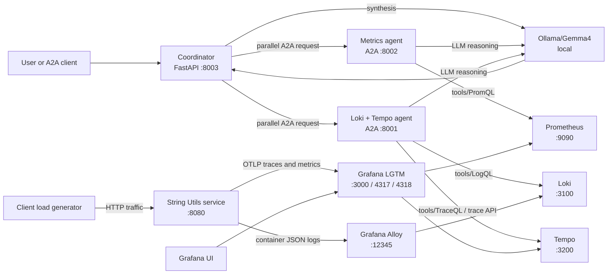

# OpenTelemetry A2A Incident Investigation


A local observability lab that turns generated application traffic into an evidence-based incident investigation. A Spring Boot service emits telemetry through OpenTelemetry/OTLP; the Grafana LGTM stack collects and stores it; two specialized A2A agents investigate that telemetry; and a coordinator combines their findings into one structured RCA (Root Cause Analysis).


## Purpose

The project demonstrates a practical pattern for observability-aware AI systems:

- generate telemetry from a controlled workload
- investigate each telemetry domain with a specialized agent
- correlate aggregate metrics with application-level logs and traces
- distinguish observed evidence from inference
- keep unsupported root causes explicitly unknown

The system is designed for local experimentation and demonstrations, not telemetry retention or production deployment.

## Architecture



## Components

| Module | Role | Documentation |
| --- | --- | --- |
| `server/` | Spring Boot string service; produces OpenTelemetry traces, metrics and structured logs | [server/README.md](server/README.md) |
| `client/` | Spring Boot load generator; continuously calls the service endpoints | [client/README.md](client/README.md) |
| `loki/` | A2A specialist for Loki logs and Tempo traces | [loki/README.md](loki/README.md) |
| `metrics/` | A2A specialist for Prometheus metrics and PromQL | [metrics/README.md](metrics/README.md) |
| `coordinator/` | FastAPI coordinator; delegates investigations in parallel and synthesizes the RCA | [coordinator/Readme.md](coordinator/Readme.md) |
| `common/` | Shared Ollama client used by the Python agents |  |

## Telemetry flow

1. The `string-utils-service` exposes string operations and can simulate latency and failures.
2. The client sends continuous requests to `/api/strings/length`, `/api/strings/reverse` and `/api/strings/upper`.
3. The Docker environment collects metrics and traces in the Grafana LGTM stack, while Grafana Alloy forwards container logs to Loki.
4. The metrics and Loki/Tempo agents receive the same service and time window through A2A and investigate their own telemetry domains.
5. The coordinator sends both investigations concurrently, then asks Ollama to correlate the returned evidence into a structured RCA.

A metric trend and a trace are not automatically the same request. The coordinator therefore preserves the distinction between aggregate evidence, request-level evidence and inferred conclusions.

## Requirements

- Windows, Linux, or macOS
- Docker Desktop or Docker Engine with Compose
- Java 25 and either Maven 4 or the Maven wrappers included in server/ and client/
- Python 3.11+
- [`uv`](https://docs.astral.sh/uv/) for the agent environment
- Ollama installed and running
- The configured `gemma4` model pulled locally
- At least 8 GB of available memory is recommended for the observability stack and local model

The Python agent dependencies are pinned in [requirements.txt](requirements.txt): A2A SDK, FastAPI, HTTPX, Ollama and Uvicorn.

## Setup the agent environment

From the repository root:

```bash
uv venv .a2a_env
```

Activate it by command line:

```bash
./.a2a_env/Scripts/Activate
```

Install the pinned dependencies:

```bash
uv pip install -r requirements.txt
```

## Prepare the local model

Make sure Ollama is installed and running, then pull the model:

```bash
ollama pull gemma4
```

Verify it is available:

```bash
ollama list
```

## Run the complete system

Use separate terminals. The order matters.

### Start the server and LGTM stack

```bash
cd server
docker compose up --build
```

This starts the Spring Boot service, Grafana, Loki, Tempo, Prometheus, OTLP ingestion and Alloy. Keep this terminal and all LGTM containers running throughout the experiment.

### Start the client load generator

In a second terminal, from the repository root:

```bash
cd client
mvn spring-boot:run -Dspring-boot.run.arguments="--threads=4 --server-url=http://localhost:8080"
```

The client must run long enough to create the telemetry window that the agents will investigate. See [client/README.md](client/README.md) for configuration.

### Start the Loki/Tempo A2A agent

In a third terminal, from the repository root with `.a2a_env` active:

```bash
python -m loki.log_analysis_agent.a2a_server
```

The default endpoint is `http://127.0.0.1:8001/`.

### Start the Prometheus A2A agent

In a fourth terminal:

```bash
python -m metrics.metrics_analysis_agent.a2a_server
```

The default endpoint is `http://127.0.0.1:8002/`.

### Start the coordinator

In a fifth terminal:

```bash
uvicorn coordinator.server:app --host 127.0.0.1 --port 8003
```

The coordinator is available at `http://127.0.0.1:8003`. It expects the specialist agents at ports 8001 and 8002, as configured in [coordinator/config.py](coordinator/config.py).

### Submit an investigation

Structured request:

```bash
curl.exe -X POST http://127.0.0.1:8003/investigate `
  -H "Content-Type: application/json" `
  -d '{"service_name":"string-utils-service","time_range":{"start":"2026-09-04T20:45:00Z","end":"2026-09-04T21:00:00Z"}}'
```

Natural-language request:

```bash
curl.exe -X POST http://127.0.0.1:8003/investigate/text `
  -H "Content-Type: application/json" `
  -d '{"message":"Investigate string-utils-service between 2026-09-04T20:45:00Z and 2026-09-04T21:00:00Z."}'
```

The coordinator returns a structured result containing the specialist findings, an evidence chain, correlated evidence, failure mechanism, unknowns and confidence.

For a representative example of the coordinator response, see the [coordinator README](coordinator/Readme.md).


## Important: telemetry is ephemeral

The default Docker setup does not configure persistent storage for the LGTM services. Logs, traces and metrics can be lost when the containers are stopped, recreated, or reset.

Keep the `lgtm` and `alloy` containers running while the client generates traffic and while all agents investigate. Start the agents only after telemetry exists and use a time window that falls within the period where the containers were running. For durable data, add persistent volumes and production retention settings before adapting this setup beyond local demonstrations.

## Useful endpoints

| Service | URL | Purpose |
| --- | --- | --- |
| String Utils | `http://localhost:8080` | Application API |
| Grafana | `http://localhost:3000` | Explore metrics, logs and traces |
| Prometheus | `http://localhost:9090` | Metrics API and queries |
| Loki | `http://localhost:3100` | Logs API |
| Tempo | `http://localhost:3200` | Traces API |
| Coordinator | `http://localhost:8003` | Northbound investigation API |
| Metrics agent | `http://localhost:8002` | Prometheus A2A agent |
| Loki/Tempo agent | `http://localhost:8001` | Loki/Tempo A2A agent |

## Stop the system

Stop the client and Python processes with `Ctrl+C`. Then stop the Docker environment:

```bash
cd server
docker compose down
```

For module-specific configuration, telemetry details and direct agent examples, see the 
- [server README](server/README.md), 
- [client README](client/README.md), 
- [Loki README](loki/README.md), 
- [metrics README](metrics/README.md) and 
- [coordinator README](coordinator/Readme.md).
